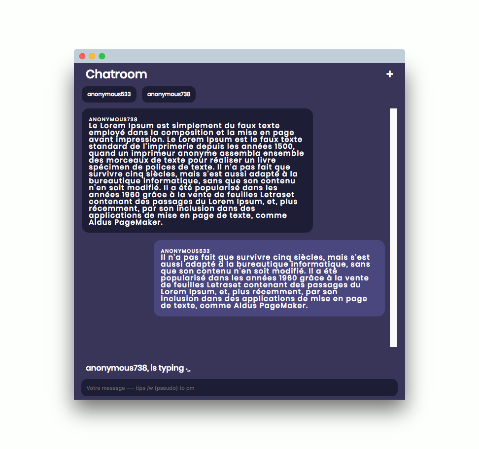

# Chatroom

Simple application chatroom using NodeJS + React + Redux + socketio

# Features

* By default you have a random username
* Change username.
* Send messages to all connected users.
* Send private message typing `/w ${username}` before your message.
* Display of `${users} are typing...`
* Display of all users connected

# Run application

* `yarn install` for install dependecies
* `yarn start:server` for run back server
* `yarn start` for buil front application

# Some possible improvements

If you want practice using this base code you can add :

* Stock messages in back server for allow persist messages (like 100 latest for not surcharged server)
* Add timestamp to each message
* If you click on username it could be insert `/w ${thisUsername} to the input message

# Author

Justin Rabiller

I made this application to practice my react lessons. Feel free to use it, read the code, optimise, all you want whit this repo ! If you have any advice contact me !

> justin.rabiller@gmail.com

[Licence](LICENSE)